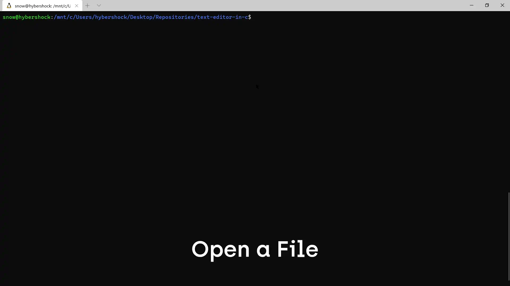

## Terminal based text editor in C
A hobby project to tinker with old technology.

The project is based on the guide by [snaptoken](https://viewsourcecode.org/snaptoken/kilo/index.html) which is in turn based on [Kilo](http://antirez.com/news/108).

### Run
```
make
./kilo.out <filename>
```

### Demo
